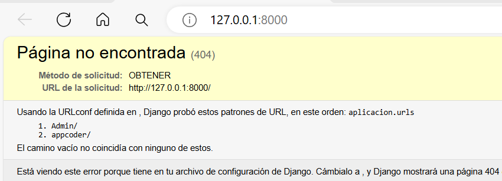
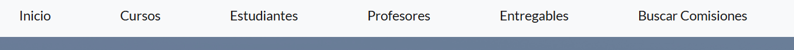
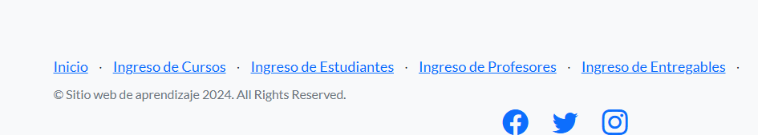
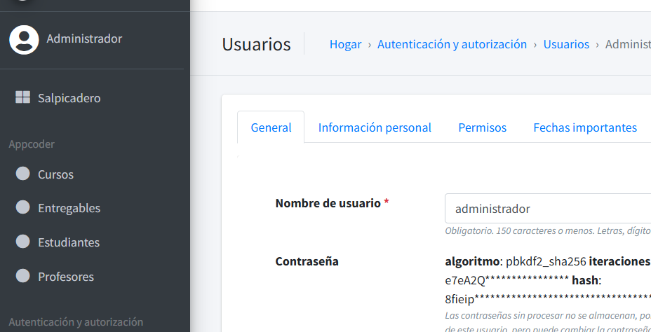
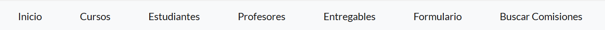

El presente ProyectoAPP refleja una web de aprendizaje el cual nos permitira almacenar datos desde la web de cursos y sus respectivas comisiones(codigo de comision o identificador), el mismo posee distintas botoneras configuradas para que al finalizar visualizemos los datos ingresados o busquemos comisiones por identificador.

Paso a paso de empleo de la pagina:

* debemos ingresar en la URL : http://127.0.0.1:8000/appcoder para que la misma pueda iniciar el index de la pagina.
* luego si tildamos los botones principales nos mostrara la visualicion de los datos ingresados en cada tabla, en los datos Cursos, Estudiantes, Entregables, Profesores y hasta nos permitira buscar las comisiones de los cursos inscritos:
* En la botonera inferiro nos permitira ingresar datos directo en la Base de datos, esto lo podemos validar luego de ingresados en sqlite o con el usuario Admin de la pagina:
* El usuario del acceso es Admin y la contraseña es 1811181211.
* 

a continuacion los pasos para su visualizacion y uso:

1. 
2. Boton Inicio despliega la funcionalidad de presentacion del index o inicio de la pagina el emblema que deseamos proyectar.
3. Boton Cursos nos permitira Visualizar los cursos añadidos en la web.
4. def curso(request):

   cursos = Curso.objects.all()

   returnrender(request, "appcoder/cursos.html", {"cursos":cursos})

Boton Estudiantes a futuro nos permitira Visualizar los Estudiantes inscritos en la web.

Boton Profesopres a futuro nos permitira Visualizar los Profesores que dictan los cursos.

Boton Entregables a futuro nos permitira Visualizar los Entregables ejecutados en la web.

Ingreso de datos:

1. Boton formulario nos permite ingresar Cursos y comisiones a traves de una Clase y Html creada para ello, en la clase definimos los siguientes parametros:
2. 

class MiFormulario(forms.Form):

    nombre = forms.CharField()

    comision = forms.IntegerField()

Esto nos permitira ingresar datos de texto y de numero sin restricciones por ahora.

Nuestro HTML:



<pstyle="color: red;"> Datos Mal Ingresados, revisar `
`



<formaction=""method="POST">

    `<table>`

    {{ formulario.as_table }}

    `</table>`

    <inputtype="submit"value="Enviar">

</form>

nos permite con el metodo API ingresar datos en nuestra base de datos con una vista integra de solo el nombre y la comision.

Por ultimo nuestro buscador:

Buscar Comisiones

defbuscarcomision(request):

    returnrender(request, "appcoder/buscarcomision.html")

defbuscar(request):

    ifrequest.GET["comision"]:

    ##respuesta = f"Estoy buscando la comision nro: {request.GET["comision"] }"

    comision = request.GET['comision']

    cursos = Curso.objects.filter(comision__icontains=comision)

    returnrender(request, "appcoder/resultadosBusqueda.html", {"cursos":cursos, "comision":comision})

    else:

    respuesta= "No enviar datos"

    returnHttpResponse(respuesta)

esto nos permitira buscar las comisiones inscritas en nuestro portal.

por ahora es una definicion de la web muy limitada y buscaremos de continuar con las mejoras para un desarrollo mas como y esteticamente mas visual.

muchas gracias.
